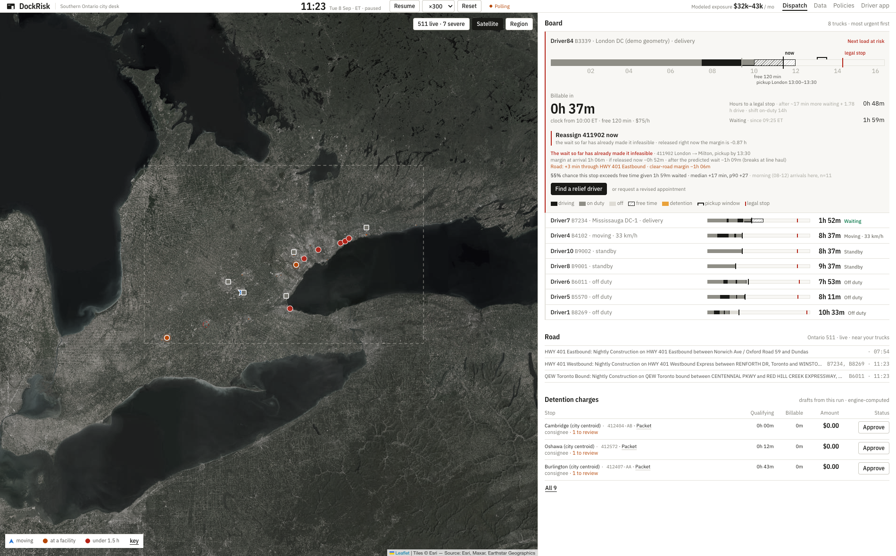

# DockRisk

DockRisk helps Southern Ontario city dispatchers decide what to do when a truck waits at a dock. It checks whether the next load still fits the driver's available hours, compares relief drivers, and prepares detention charge drafts with supporting evidence. Built for RoadStar Hackathon 2026.

A wait can make the next load infeasible while the stop is still inside its contractual free time. The dispatch board shows that conflict alongside the billing clock, so the dispatcher can review a reassignment before a charge starts accruing.

[Live app](https://dockrisk.vercel.app) · [3-minute demo video](https://youtu.be/MQjygr_Ms6Q) · [Pitch deck PDF](https://drive.google.com/file/d/1jNckVV1RI5o1IwJMCqs_j0brUNdBnzkD/view) · [PowerPoint with embedded demo](https://drive.google.com/file/d/1CfwSAcBgjlEAAQQRUWHLHvM6_X1-k5Rm/view)

The hosted app uses fictional customers and generated data. Its simulation is shared: another visitor can pause, reset, or change an assignment. The video walks through prepared scenarios. The deck contains a separate 90-second recording on slide 9; its PDF shows the video poster.



In this local capture, B3339's next-load plan is already infeasible at 11:23. Billing starts at 12:00. The 37 minutes shown are the remaining free time; the capture does not establish when the risk first appeared.

## What the demo does

1. The dispatcher opens a truck's row to compare waiting time, the billing clock, and the hours margin for the next load. The plan check includes estimated road delay.
2. "Find a relief driver" shows arrival estimates, trailer checks, and hours margins. Ineligible candidates have stated blockers. The baseline allows 45 minutes at each dock; historical median and busy-day dock times show how the same plan changes under different assumptions.
3. Dispatch offers the load. The driver can accept or decline in the companion app. Acceptance updates the assignment and appears on the dispatch board.
4. After a stop closes, the engine creates a charge draft. Its evidence packet contains the calculation, event times, sources, and review reasons. The dispatcher reviews the draft before approving it.

AI reads detention terms from agreement text and drafts a customer notice from the evidence packet. Dispatch confirms the extracted terms, and the rules engine calculates the amounts. If a model is unavailable, the app labels its rules-parser or template fallback. The prototype does not send customer emails or create invoices in an external billing system.

## What the historical data supports

The figures below come from Southern Ontario stops spanning 56 days in the organizer's TruckMate export. Historical dwell is measured once per bill and stop kind, from the earliest recorded dock arrival to pickup or delivery completion. The public sample produces different results.

| Calculation | Result | Assumptions |
| --- | --- | --- |
| Physical dwell beyond free time | $32,322 to $43,095 per 30 days | Two hours free; $75 to $100 per hour |
| Appointment-adjusted charge replay | $57,638 over 56 days, about $30,877 per 30 days | Two hours free; $75 per hour; 15-minute increments rounded down |

Both estimates describe modeled exposure or potential draft charges. The export has no invoices or contract rates, so these amounts cannot establish unpaid revenue, collectible claims, or recovered money. Completion timestamps are a proxy for the end of a stop.

The detention warning model trains on stops completed before a cutoff 28 days into the history and scores later stops. Among 173 eligible decisions, it issued 145 warnings: 115 stops exceeded free time and 30 did not. It missed 11 overruns, giving 91% recall and 79% precision. Compared with warning on every eligible stop, that removes 17 false alarms and adds 11 misses.

This evaluation covers warnings made 30 minutes before detention billing. It does not validate the live HOS predictions, reassignment outcomes, or the effect of using DockRisk in a dispatch office. The export contains driver snapshots and lacks duty-event history; the demonstration uses seeded duty events. See the [Q&A](docs/demo/qa-sheet.md) for the evaluation details and limitations.

## Run locally

You need Python 3.12 or later, `uv`, Node.js 20.9 or later, npm, and a shell with Bash and `curl`. Run these commands from the repository root:

```bash
cd services && uv sync
cd ../apps/web && npm ci
cd ../..
scripts/demo.sh 60
```

The helper starts the API, web app, and a fresh simulation. If `data/roadstar.db` is absent, it imports the organizer workbook when available; otherwise it generates and imports the synthetic sample. It then derives the dwell history and model.

| View | Local URL |
| --- | --- |
| Dispatch | http://localhost:3000 |
| Driver selector | http://localhost:3000/driver |
| Data and replay | http://localhost:3000/data |
| Detention terms | http://localhost:3000/policies |
| API documentation | http://localhost:8000/docs |

`--speed 60` means one simulated minute per real second. The helper's equivalent argument is `scripts/demo.sh 60`. A local replay runs for seven simulated hours, then waits for a reset. Use the app's Pause, Resume, and Reset controls to inspect a scenario. Reset clears the scenario's visits, charges, and assignments. Driver names and available relief candidates depend on the imported dataset; use the driver selector instead of assuming `/driver/Driver84` exists.

Logs are in `.demo-logs/`. `scripts/demo.sh stop` stops the services. The helper stops processes by name, including `next dev`; use separate terminals if you also run other Next.js or FastAPI projects on the same machine.

### Start the processes separately

After installing dependencies, prepare the sample from the repository root:

```bash
cd services
uv run python -m core.importer --xlsx data/sample/Hackathon_Data_SAMPLE.xlsx
uv run python -m core.analytics
```

Then open three terminals, each starting at the repository root:

```bash
# Terminal 1: API
cd services && uv run uvicorn api.main:app --port 8000
```

```bash
# Terminal 2: web
cd apps/web && npm run dev
```

```bash
# Terminal 3: simulator, after the API is ready
cd services && uv run python -m sim.main --reset --speed 60
```

The web app defaults to `http://localhost:8000`. Set `NEXT_PUBLIC_API_URL` in `apps/web/.env.local` to use another API. Optional model settings belong in the git-ignored `services/.env`: `OPENAI_BASE_URL`, `OPENAI_API_KEY`, `DOCKRISK_EXTRACT_PROVIDER`, and `DOCKRISK_EXTRACT_MODEL`. The OpenAI-compatible proxy needs both a base URL and a key. The extraction and notice modules also support Anthropic credentials and an OpenRouter fallback.

Map tiles, Ontario 511 events, and uncached OSRM routes need network access. Route geometry is cached in `data/geo/routes.json`; if OSRM is unavailable, the simulator falls back to straight lines.

### Use the organizer workbook

The non-public workbook is excluded from this repository. If you have permission to use it, place it at `data/portal-downloads/Hackathon_Data.xlsx`, stop the local services, and run from the repository root:

```bash
cd services
uv run python -m core.geocode
uv run python -m core.importer
uv run python -m core.analytics
```

Geocoding caches city and postal-code results in `data/geo/` and spaces requests to Nominatim. The sample can use built-in city coordinates without this step. Importing rebuilds the reference tables but preserves live tables; start a fresh simulation when switching datasets. To regenerate the fictional workbook, run `cd services && uv run python -m core.synthetic` from the repository root.

## Tests and replay

From the repository root:

```bash
cd services && uv run pytest
```

The suite covers HOS rules, geofence visits, charge calculations, relief eligibility and acceptance, model fallbacks, and synthetic-data import. API flow tests use temporary databases.

To print the historical replay for the currently imported dataset:

```bash
cd services && uv run python -m core.backtest
```

The same result is available at `GET /backtest` and on the app's `/data` page. Customer names are anonymized in replay output.

Check the web production build from the repository root:

```bash
cd apps/web && npm run build
```

The build fetches fonts from Google Fonts and needs network access for that step.

## Code map

The frontend uses Next.js, React, and Leaflet. FastAPI exposes the Python rules engine and SQLite store; the simulator sends telemetry and duty events to the API over HTTP.

| Path | Responsibility |
| --- | --- |
| `services/core/importer.py`, `analytics.py`, `backtest.py` | Workbook import, data-quality report, dwell history, and historical replay |
| `services/core/hos.py`, `matching.py`, `road.py` | Forward hours checks, relief-driver ranking, and estimated road delays |
| `services/core/geofence.py`, `visits.py` | Property and dock transitions, detention policies, charge drafts, and evidence |
| `services/core/policy_extract.py`, `notice.py`, `llm.py` | Agreement parsing, notice drafting, and provider fallbacks |
| `services/api/main.py` | FastAPI endpoints, telemetry and duty ingestion, snapshots, and SSE updates |
| `services/sim/main.py` | Scripted dock waits, truck movement, and the shared scenario clock |
| `apps/web` | Next.js dispatcher dashboard, Leaflet map, driver companion, and evidence view |
| `docs/brief`, `docs/plan`, `docs/second-opinion` | Data findings, implementation plans, and design reviews, including corrected findings |

## Operational limits

The HOS engine implements Canadian driving, on-duty, elapsed-time, rest, and cycle checks for the prototype. The driver companion is not a certified ELD. Section 76 adverse-driving provisions appear as possible exceptions requiring review; the engine does not grant them automatically.

The Trucks sheet contains only a truck identifier, so the export cannot support axle-weight compliance. Relief matching checks trailer type and available capacity data. Its driving times and dock allowances are estimates that need operational validation.

City-centroid facilities and drawn demo polygons are labeled as simulation geometry. They do not establish a verified dock visit, and associated charges require review. Leg-level HOS values in the export are frozen copies per driver; driver-sheet values and simulated duty events have separate roles in the prototype.

## Hosting

The web app runs on Vercel at [dockrisk.vercel.app](https://dockrisk.vercel.app). The API and simulator run together on a VPS at [dockrisk-api.myarchive.cc](https://dockrisk-api.myarchive.cc), behind Cloudflare Tunnel and Caddy. The container uses the synthetic workbook; the organizer workbook and local database are excluded from its build context.

Automatic Git deployments are disabled in [`apps/web/vercel.json`](apps/web/vercel.json) so documentation updates do not start a build. Set `git.deploymentEnabled` to `true` when automatic deployments are needed again. See [Vercel's Git configuration](https://vercel.com/docs/project-configuration/git-configuration#turning-off-all-automatic-deployments).

The linked Vercel project's Root Directory is `apps/web`. Deploy manually from the repository root so the root `.vercelignore` excludes recordings, analysis, caches, and private data:

```bash
vercel deploy --prod
```

Set `NEXT_PUBLIC_API_URL` in the Vercel project to the deployed API URL. `services/Dockerfile` builds the backend container. The existing `scripts/deploy-vps.sh` requires `DOCKRISK_VPS=user@host`, SSH access, `services/.env`, and the route/city caches at `data/geo/routes.json` and `data/geo/cities.json`. It deploys committed source plus those caches using `deploy/vps/docker-compose.yml`, which expects the host's existing `ketchio-web` Docker network.
